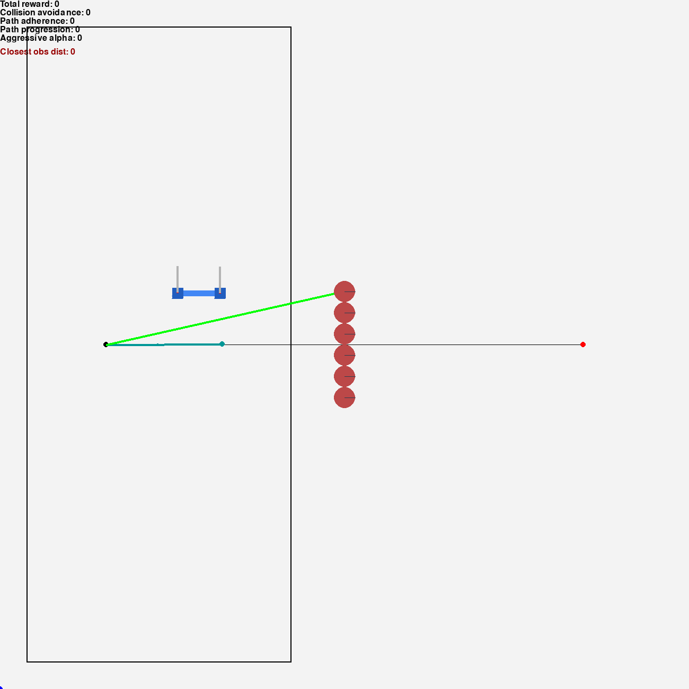

# Drone-2d-custom-gym-env-for-reinforcement-learning
## Gifs
### Gifs of the reactive agent in each test scenario

## Installation

### Installation via pip - package installer for Python

### Installation via source code from GitHub repository

### How to use it in your code

### Environment prerequisites

Environment to run needs Python3 with Gym, Pygame, Pymunk, Numpy and StableBaselines3
libraries.

## Environment details

### Initial episode conditions

### Ending episode conditions

### Agent action and observation space

### Reward function

### Environment parameters

## See also

